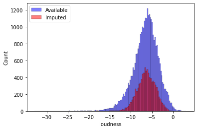
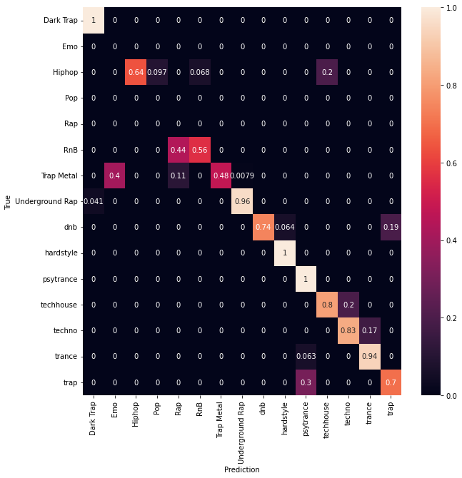
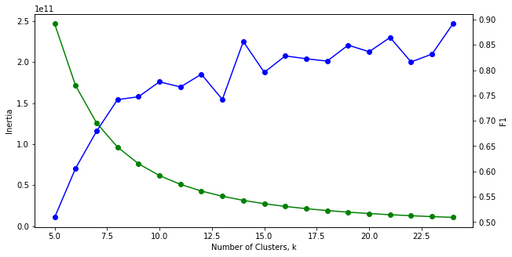
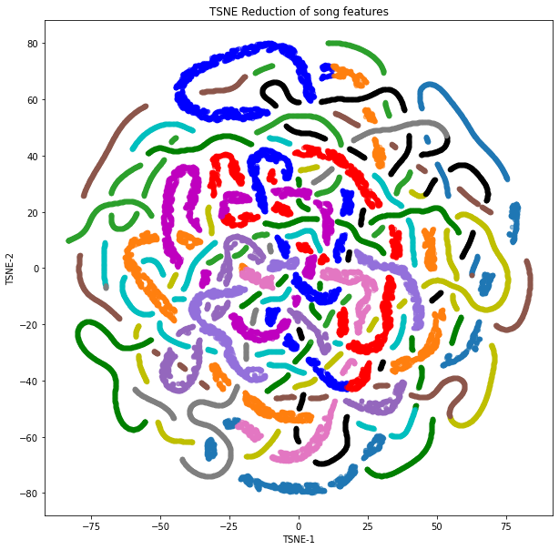

# Unsupervised Learning Techniques Applied to the Songs Dataset from Spotify

This document summarizes the results obtained after applying unsupervised learning techniques to the [Dataset of Songs from Spotify](https://www.kaggle.com/datasets/mrmorj/dataset-of-songs-in-spotify). The dataset is a compilation of 42,896 songs for which mainly the [audio features](https://developer.spotify.com/documentation/web-api/reference/#/operations/get-several-audio-features) have been collected:

> - `danceability`: Danceability describes how suitable a track is for dancing based on a combination of musical elements including tempo, rhythm stability, beat strength, and overall regularity. A value of 0.0 is least danceable and 1.0 is most danceable.
> - `energy`: Energy is a measure from 0.0 to 1.0 and represents a perceptual measure of intensity and activity. Typically, energetic tracks feel fast, loud, and noisy. For example, death metal has high energy, while a Bach prelude scores low on the scale. Perceptual features contributing to this attribute include dynamic range, perceived loudness, timbre, onset rate, and general entropy.
> - `key`: The key the track is in. Integers map to pitches using standard [Pitch Class notation](https://en.wikipedia.org/wiki/Pitch_class).
> - `loudness`: The overall loudness of a track in decibels (dB). Loudness values are averaged across the entire track and are useful for comparing relative loudness of tracks. Loudness is the quality of a sound that is the primary psychological correlate of physical strength (amplitude). Values typically range between -60 and 0 db.
> - `mode`: Mode indicates the modality (major or minor) of a track, the type of scale from which its melodic content is derived. Major is represented by 1 and minor is 0.
> - `speechiness`: Speechiness detects the presence of spoken words in a track. The more exclusively speech-like the recording (e.g. talk show, audio book, poetry), the closer to 1.0 the attribute value. Values above 0.66 describe tracks that are probably made entirely of spoken words. Values between 0.33 and 0.66 describe tracks that may contain both music and speech, either in sections or layered, including such cases as rap music. Values below 0.33 most likely represent music and other non-speech-like tracks.
> - `acousticness`: A confidence measure from 0.0 to 1.0 of whether the track is acoustic. 1.0 represents high confidence the track is acoustic.
> - `instrumentalness`: Predicts whether a track contains no vocals. "Ooh" and "aah" sounds are treated as instrumental in this context. Rap or spoken word tracks are clearly "vocal". The closer the instrumentalness value is to 1.0, the greater likelihood the track contains no vocal content. Values above 0.5 are intended to represent instrumental tracks, but confidence is higher as the value approaches 1.0.
> - `liveness`: Detects the presence of an audience in the recording. Higher liveness values represent an increased probability that the track was performed live. A value above 0.8 provides strong likelihood that the track is live.
> - `valence`: A measure from 0.0 to 1.0 describing the musical positiveness conveyed by a track. Tracks with high valence sound more positive (e.g. happy, cheerful, euphoric), while tracks with low valence sound more negative (e.g. sad, depressed, angry).
> - `tempo`: The overall estimated tempo of a track in beats per minute (BPM). In musical terminology, tempo is the speed or pace of a given piece and derives directly from the average beat duration.
> - `type`: The object type, `audio_features`.
> - `duration_ms`: The duration of the track in milliseconds.
> - `time_signature`: An estimated time signature. The time signature (meter) is a notational convention to specify how many beats are in each bar (or measure). The time signature ranges from 3 to 7 indicating time signatures of "3/4", to "7/4".
> - `genre`: Genre/class the song belongs to; in a classification problem, this would be the **target** or **dependent variable**.
> - `song_name`: Song name.
> - `title`: Album title.

After dropping the duplicates and merging the fields `song_name` and `title`, we end up with a dataset of shape `(41975, 15)`, i.e., 41,975 songs with 14 independent features each, and a target value `genre`.

In a regular classification problem, we would predict one of the 15 possible classes for the field `genre`: 'Dark Trap', 'Underground Rap', 'Trap Metal', 'Emo', 'Rap', 'RnB', 'Pop', 'Hiphop', 'techhouse', 'techno', 'trance', 'psytrance', 'trap', 'dnb', 'hardstyle'.

However, this small project tries to use **clustering** techniques to see how well the available features indeed map to the genre classification; in other words, the following questions are tried to be answered:

*Are the ground truth classification labels sensible? Which classes could be reconsidered for other music genres?*

To do so, the following sections are provided: 

- [Data processing](#Data-processing)
- [Clustering with three methods](#Clustering-with-three-methods)
- [Elbow technique applied to K-means](#Elbow-technique-applied-to-K-means)
- [Dimensionality reduction for dataset visualization](#Dimensionality-reduction-for-dataset-visualization)
- [Conclusions and next steps](#Conclusions-and-next-steps)

**The original notebook with all the calculations can be found here: [`music_genre_classification/UnsupervisedLearning.ipynb`](https://github.com/mxagar/music_genre_classification/blob/main/data_analysis/UnsupervisedLearning.ipynb).**

## Data processing

As already mentioned, the preliminary processing steps consist in the following steps:

- Drop duplicates.
- Merge `song_name` and `title`.

After that, these feature engineering techniques have been applied:

- Being `loudness` the only feature with missing values, data imputation has been applied using KNN.
- All numerical features have been transformed with `log1p()` if their absolute skew was larger than 0.75.
- The two categorical features (`time_signature` and `key`) have been mapped to an ordinal ranking.
- The merged text field has been vectorized with `TfidfVectorizer`, to get a song-token matrix which captures word frequencies correctly; note that the most 500 relevant words have been considered.
- Target label have been encoded.
- Even though it was not necessary for all the downstream processing steps, all features have been scaled to their standard distribution.

As mentioned, `loudness` is the only feature which has been imputed; since a large number of values was missing (roughly 21%), the K nearest neighbors technique has been applied to regress the missing values from similar data points. The goal has been to at least preserve the feature distribution and to fill the blanks with sensible and particularized values. The following figure shows the distributions of the available and imputed value distributions for `loudness`:

## Clustering with three methods

Three clustering methods have been applied:

- K-means
- Gaussian Mixtures Model
- Hierarchical Agglomerative Clustering

The choice has been made because all three of them take the number of clusters (`n_components`) as a prior data; that initial clustering constraint is given by the analyzed dataset.

In order to evaluate the performance of the clustering algorithms, the average F1 score (across all classes) has been computed. That requires mapping the predicted cluster labels to the original song class labels. To achieve that, the most common song class of each predicted cluster has been taken.

These are the final results:

	K-means, f1 = 0.796
	Gaussian Mixtures, f1 = 0.670
	Hierarchical Agglomerative Model, f1 = 0.828

The hierarchical agglomerative clustering seems to perform best, followed by the K-means clustering. This is the confusion matrix of that best method:

## Elbow technique applied to K-means

The following diagram shows how the inertia and the F1 scores vary when the number of clusters is changed:

The real constraint is 15, and it seems to be a good prior.

## Dimensionality reduction for dataset visualization

Finally, the dataset has been reduced to 2D using the T-SNE manifold learning technique:

## Conclusions and next steps

Regarding the original research question, and observing the results, we could say the following:

- The genre classification labels seem to be very plausible, since clustering techniques find similar groups with good scores.
- The genre classes `Pop`, `Rap` and `Emo` are the most confused ones and could cause problems in the classification.

We could further proceed with the following **improvements**:

- [ ] Implement a better mapping between the predicted and the ground truth clusters: to avoid classes not being assigned, look at all possible classes, not the most common one only.
- [ ] Add the clustering value to the dataset to check whether the classification is improved.
- [ ] Apply grid search to the clustering techniques to fund the optimum hyperparameters.

## Authorship

Mikel Sagardia, 2022.  
No guarantees.