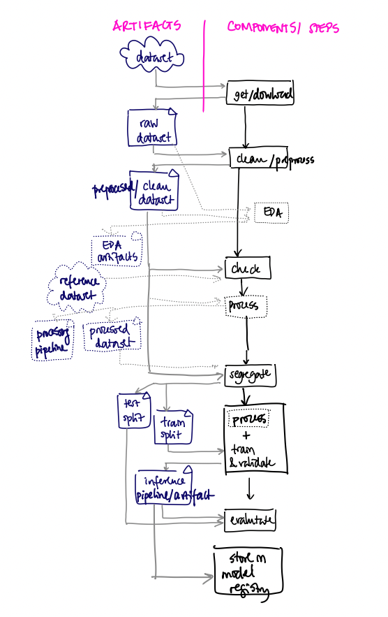

# Reproducible ML Pipelines: Segregate (Step 4/6)

As introduced in the root `README.md`, we have the following generic steps in a reproducible ML pipeline:

1. Get data: `get_data`
2. Clean / Proprocess: `preprocess`
3. Check data: `check_data`
4. **Segregate data: `segregate`**
5. Inference Pipeline: Process + Train + Validate: `train_random_forest`
6. Evaluate: `evaluate`



This folder deals with the step or component **number 4: Segregate**.

This component is executed by the root level `mlflow` command, which gets the configuration parameters either **(1) from the root `config.yaml` using `hydra` (2) or these are hard-coded in the `main.py` script from the root level**. MLflow sets the required environment defined in the current/local `conda.yaml` automatically. We can also run this component locally and independently from the general project by invoking the local `MLproject` file as follows:

```bash
# The MLproject file in . is used
mlflow run . \
-P input_artifact="preprocessed_data.csv:latest" \
-P artifact_root="data" \
-P artifact_type="segregated_data" \
-P test_size=0.3 \
-P random_state=42 \
-P stratify="genre"
```

MLflow configures the necessary conda environment and executes the following command:

```bash
# General call, without argument values
python run.py \
--input_artifact {input_artifact} \
--artifact_root {artifact_root} \
--artifact_type {artifact_type} \
--test_size {test_size} \
--random_state {random_state} \
--stratify {stratify}

# Call with real arguments
# from ../config.yaml or ../main.py
# BUT: make sure environment is correct!
# ... or just use the mlflow call above :)
python run.py \
--input_artifact "preprocessed_data.csv:latest" \
--artifact_root "data" \
--artifact_type "segregated_data" \
--test_size 0.3 \
--random_state 42 \
--stratify "genre"
```

Note that any artifact downloaded/used by this component needs to be already uploaded by previous components.

After executing `mlflow` and, through it, the script `run.py`, we generate many outputs:

- The folders `mlruns`, `wandb` and `artifacts` are created or repopulated.
- The log file `../ml_pipeline.log` is modified.
- We can see tracking information in the W&B web interface.

The script `run.py`, as in most of the other components or steps, has the following structure:

```python
# Imports
# ...

# Logger
logging.basicConfig(...)
logger = logging.getLogger()

# Component function
# args contains all necessary variables
def go(args):
    # Instantiate W&B run in a context
    # or, if preferred, without a context
    # run = wandb.init(...)
    # IMPORTANT: set project="my_project"
    # to share artifacts between different components
    with wandb.init(project="my_project", ...) as run:

        # Upload configuration params in a dictionary,
        # e.g., hyperparameters used
        run.config.update({...})

        # Download the artifacts needed
        artifact = run.use_artifact(...)
        artifact_path = artifact.file()
        df = pd.read_parquet(artifact_path)

        # Do the WORK and log steps
        # The real component functionality goes HERE
        # ...
        # ...
        logger.info("Work done")

        # Upload any generated artifact(s)
        artifact = wandb.Artifact(...)
        artifact.add_file(...) # or .add_dir(...)
        run.log_artifact(artifact)

        # Make sure the artifact is uploaded before any temp dir
        # gets deleted; this blocks the execution until then
        artifact.wait()

        # Log metrics, images, etc.
        run.log(...) # images, series of values (e.g., accuracy along time)
        run.summary['metric_A'] = ... # one value

if __name__ == "__main__":
    # Define and parse arguments
    parser = argparse.ArgumentParser(...)
    parser.add_argument(...)
    # ...
    args = parser.parse_args()

    # Execute component function
    go(args)

```

In the concrete case of the step `segregate`, we use the [Scikit-Learn](https://scikit-learn.org/stable/) functionality `train_test_split()` to create stratified train/test splits. The new segregated datasets are uploaded as a new artifacts: `data_train.csv`, `data_test.csv`. **Note that the train split will be further split into train/validation in the `train_random_forest` component, which generates the inference pipeline.**

The utility `tempfile.TemporaryDirectory()` is used to avoid having the files locally.

